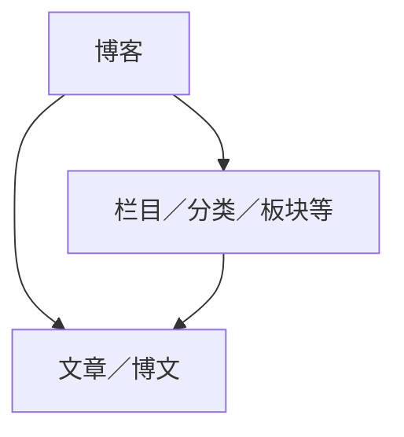

# 通用博客标签标准（草案）

```yaml
创建时间: 2023年1月1日
版本: 0.0.1-alpha
```

<ruby>通用博客标签标准<rp>(</rp><rt>General Blog Tag Standard</rt><rp>)</rp></ruby>是由 Save The Web Project 提出的开放标准。

〔后略〕

分发协议为 CC0。

## 简介

「通用博客标签标准」是为了通用性、精确描述以及可扩展性而编写的标准，所以此标准不会考虑具体的软件实现，仅仅考虑标签的样貌。

## GBTS 0000 通用博客标签标准索引

```yaml
标题: 通用博客标签标准索引
创建时间: 2023年1月1日
```

GBTS 0000 是索引，会收录所有的 GBTS 内容，并对可行性进行评议，每条 GBTS 都会被分类，分别是「正式」「草案」「延期」和「拒绝」。[^bep0000]

[^bep0000]: 借用了许多 [BEP 0000](https://www.bittorrent.org/beps/bep_0000.html)（BitTorrent 增强建议索引）的设计。

### 正式的 GBTS

暂无。

### 草案的 GBTS

以下 GBTS 正在考虑标准化。

| 序号 | 标题                                                    |
| ---- | ------------------------------------------------------- |
| 0    | [通用博客标签标准索引](#gbts-0000-通用博客标签标准索引) |
| 1    | [标签规则](#gbts-0001-标签规则)                         |
| 2    | [传递特性](#gbts-0002-传递特性)                         |
| 3    | [博文标签上限](#gbts-0003-博文标签上限)                 |
| 101  | [语言属性标签](#gbts-0101-语言属性标签)                 |
| 102  | [地域属性标签](#gbts-0102-地域属性标签)                 |
| 103  | [内容属性标签](#gbts-0103-内容属性标签)                 |
| 104  | [篇幅属性标签](#gbts-0104-篇幅属性标签)                 |

### 延期的 GBTS

小组认为以下 GBTS 没有朝着标准化的方向发展， 但他们还没有撤回。

### 拒绝的 GBTS

目前，没有 GBTS 被拒绝。

## GBTS 0001 标签规则

```yaml
标题: 标签规则
创建时间: 2023年1月1日
```

标签由英文字母、数字、一个冒号、短横线和下划线组成，通常是 `键:值` 的结构，少数情况存在仅 `键` 的结构。

### 标签代码规范

标签代码有以下规范：

+   「键」「值」由英文字母、数字、短横线和下划线组成
+   「键」的部分禁止使用下划线
+   其他字符需要被删除
+   将空格替换成下划线
+   大小写不敏感

### 标签代码翻译

考虑到多语言支持，所以标签的本体都使用英文表示，比如：

| 标签             | 标签代码                        |
| ---------------- | ------------------------------- |
| 艺术分类         | `category:Art`                  |
| 简体中文语言     | `language:zh-CN`                |
| 中国广州（地域） | `region:PRC`+`region:Guangzhou` |

然后展示时再以合适的语言进行替换翻译：

| 标签代码                        | 简体中文       |
| ------------------------------- | -------------- |
| `category:art`                  | 分类：艺术     |
| `language:zh-CN`                | 语言：简体中文 |
| `region:PRC`+`region:Guangzhou` | 地域：中国广州 |

这需要维护 CSV 表格文件来实现此功能。（或者某种相似的表）

### 无冒号兼容模式

少数情况，会遇到无法使用冒号的情况，比如 Telegram 的标签系统不支持冒号以及首位数字，所以只需要修改成下面的样子：

| 标签代码       | 无冒号兼容模式  |
| -------------- | --------------- |
| `category:art` | `_category_art` |

即在「键」的前后增加一个下划线，并移除冒号。

## GBTS 0002 传递特性

```yaml
标题: 传递特性
创建时间: 2023年1月3日
```

通常博客的结构如下所示：



+   博客
    +   栏目／分类／板块等
        +   文章／博文

如果文章未定义语言属性标签，那么会从上面的结构里寻找标签，原则是就近原则，比如名为《植物图鉴》的博文位于「图鉴」栏目下，所以优先从「图鉴」栏目的标签里寻找。

因为从上到下是逐渐精确的路径，所以可以「文章」的标签可以覆盖「博客／栏目」的标签，比如博客主要使用中文语言，但文章设置的英文语言属性标签就能覆盖。

部分标签不会进行传递，需要看每个标签的传递定义，但是在键的后面添加上 -tc (transfer characteristic 传递参数) 就能强制传递，比如博客的分类是 `category-tc:Games` 就能传递给栏目、文章等，但会受到文章覆盖的影响。

## GBTS 0003 博文标签上限

```yaml
标题: 博文标签上限
创建时间: 2023年1月14日
```

为了使标签精确，不被滥用，所以需要限制博文标签的上限，这里主要限制 GBTS 0103 内容属性标签。

### 草案

解析器只会记录博文标签里面的，前 10 个「内容属性标签」，也许这样能让作者克制，只标记文章主要的标签。

也许能与「篇幅属性标签」进行参与计算，对于「微型博客」可能会减少内容属性标签的数量，而长文应该增加数量。

比如默认情况只记录前 10 个「内容属性标签」，而微型博客只记录 5 个，万字长文可以增加到 15 个，还有一种可能性，8 万字以上的，像书一样多的博文大概就不需要限制数量了。

## GBTS 0101 语言属性标签

```yaml
标题: 语言属性标签
创建时间: 2023年1月1日
可选标签: 否
传递特性: 是
```

由于 ISO 的版权比较麻烦，[ISO 639](https://zh.wikipedia.org/wiki/ISO_639-1代码表) 的完整内容相对不是能够开箱取得的，所以还是使用开放的 [BCP 47](https://www.rfc-editor.org/info/bcp47) 的标准，这也是网站语言属性标签的规范。

BCP 47 的代码通常是语言+地区，但日语是 ja，因为日语通常只有在日本使用，或者说只有在日本的日语具有核心性，而英语有多种地区，所以开头都是 en 之后在加上地区名，比如英语（英式）的代码是 en-GB，GB 表示<ruby>大不列颠<rp>(</rp><rt>Great Britain</rt><rp>)</rp></ruby>

| 语言   | 简体中文 | 正體/繁體中文 | 英语（美式） | 英语（英式） | 日语 |
| ------ | -------- | ------------- | ------------ | ------------ | ---- |
| BCP 47 | zh-CN    | zh-TW         | en-US        | en-GB        | ja   |

BCP 47 对中文还有更精准的表述，分别是：

+   zh-cmn-Hans-CN (Chinese, Mandarin, Simplified script, as used in China)
+   cmn-Hans-CN (Mandarin Chinese, Simplified script, as used in China)
+   zh-yue-HK (Chinese, Cantonese, as used in Hong Kong SAR)
+   yue-HK (Cantonese Chinese, as used in Hong Kong SAR)

不过部分内容被 iana 废弃了，现在只有单独的 cmn 还被使用，[^ianalsr] 所以不需要使用这些表述方式。

[^ianalsr]: <https://www.iana.org/assignments/language-subtag-registry/language-subtag-registry>

```yaml
%%
Type: language
Subtag: cmn
Description: Mandarin Chinese
Added: 2009-07-29
Macrolanguage: zh
%%
Type: extlang
Subtag: cmn
Description: Mandarin Chinese
Added: 2009-07-29
Preferred-Value: cmn
Prefix: zh
Macrolanguage: zh
%%
Type: redundant
Tag: zh-cmn
Description: Mandarin Chinese
Added: 2005-07-15
Deprecated: 2009-07-29
Preferred-Value: cmn
%%
Type: redundant
Tag: zh-cmn-Hans
Description: Mandarin Chinese (Simplified)
Added: 2005-07-15
Deprecated: 2009-07-29
Preferred-Value: cmn-Hans
%%
Type: redundant
Tag: zh-cmn-Hant
Description: Mandarin Chinese (Traditional)
Added: 2005-07-15
Deprecated: 2009-07-29
Preferred-Value: cmn-Hant
%%
```

### 定义方法

通常语言属性标签是在 HTML 中已经声明，但许多静态博客生成器是在配置里写入的语言属性标签，所以博主使用其他语言编写博文时，语言属性标签不会产生变化，导致语言属性标签与实际的内容不符的情况，所以通常得使用正则式匹配字符，或者人力确认语言。

除了定义语言之外，可以可对一些支持多语言的属性标签进行多语言标注，那么其 YAML 片段大概如下：

```yaml
- 标题:
  - language-zh-CN: "2022 年度最佳"
  - language-en-US: "The Best of 2022"
- 简介:
  - language-zh-CN: "回顾今年最佳的内容吧！"
  - language-en-US: "Check out this year's best content!"
```

### 表示方式

只要在语言代码前加上 `language:` 的前缀就好。比如简体中文的网站使用 `language:zh-CN`。

如果是作为属性标签的多语言标注，那么将冒号变更为短横线，作为「键」来使用。

## GBTS 0102 地域属性标签

```yaml
标题: 地域属性标签
创建时间: 2023年1月1日
可选标签: 是
传递特性: 是
```

### 定义方法

根据文章中是否有地域描述，来决定是否写上地域属性标签，因为这是可选标签，不是必须的。

+   缺省值：`region:null`

### 表示方式1

只要在英文地域前加上 `region:` 的前缀就好，比如中国广州使用（这些写法都是等价的）：

+   `region:Mainland_China`+`region:Guangzhou`
+   `region:PRC`+`region:Guangzhou`
+   `region:Peoples_epublic_of_China`+`region:Guangzhou`

备注：如果也可以只表示广州 `region:Guangzhou`，然后使用解析器添加中国。

缺点是多地域的支持会比较复杂，对解析器的要求较高，并且单独写下城市的方法可能与同名的城市或地区出现混淆。

### 表示方式2

只要在英文地域前加上 `region:` 的前缀就好，比如中国广州使用（这些写法都是等价的）：

+   `region:Mainland_China/Guangzhou`
+   `region:PRC/Guangzhou`
+   `region:Peoples_epublic_of_China/Guangzhou`

缺点是 Telegram 等需要兼容性的地方无法使用。

### 表示方式3

只要在英文地域前加上 `region:` 的前缀就好，比如中国广州使用（这些写法都是等价的）：

+   `region:Mainland_China:Guangzhou`
+   `region:PRC:Guangzhou`
+   `region:Peoples_epublic_of_China:Guangzhou`

缺点是 Telegram 等需要兼容性的地方无法使用。

### 表示方法的备注

上面的表示方法，等到正式版理应只保留一种。

### 备注

〔理论上应该支持多个地域，不过这个实现有点复杂的样子〕

## GBTS 0103 内容属性标签

```yaml
标题: 内容属性标签
创建时间: 2023年1月3日
可选标签: 是
传递特性: 否
```

Telegram 的频道分类比较成熟，所以直接照搬了其分类，有少量调整。然后合并了 [ooh.directory](https://ooh.directory/) 的博客分类。分类作为内容属性标签的一级标签，其下还可以有很多可以描述具体内容的二级标签。以下是一些分类以及可能的二级标签：

| 英文             | 中文         | 二级标签（中文） |
| ---------------- | ------------ | ---------------- |
| Politics         | 政治         | 民主政治         |
| Videos (Movies)  | 视频（电影） | 喜剧电影         |
| Entertainment    | 娱乐         | 旅游             |
| Books            | 图书         | 儿童图书         |
| Music            | 音乐         | 古典音乐         |
| News             | 消息         |                  |
| Education        | 教育         | 高等教育         |
| Technology       | 技术         | 土木工程         |
| Games            | 游戏         | 单机游戏         |
| Apps             | 应用程序     |                  |
| Blogs            | 博客         |                  |
| Linguistics      | 语言学       | 语音学           |
| Business         | 商业（公司） | 市场营销         |
| Food             | 食物         |                  |
| Art              | 艺术         |                  |
| Sales            | 销售         |                  |
| Adult            | 成人         |                  |
| Cryptocurrencies | 加密货币     |                  |
| Other            | 其他         |                  |

### 细节

考虑到表格转换到爬虫读取的数据过于麻烦，为了便于维护，还是直接建立一个数据结构比较好，下面我使用 YAML 创建了包含标签、译名、简介和子类型的数据，应该会有些帮助。

目前只使用了 `language-zh-CN` 表示中文翻译，`summary` 表示简介，`subtype` 表示子分类，所以应该不会很复杂。

```yaml
Arts:
- language-zh-CN: 艺术
- summary: Arts and media:
  - language-zh-CN: 艺术与作品
- subtype:
  - Architecture:
    - language-zh-CN: 建筑
  - Books:
    - language-zh-CN: 书籍
  - Crafts:
    - language-zh-CN: 工艺品
  - Design:
    - language-zh-CN: 设计
  - Fashion:
    - language-zh-CN: 时尚
    - summary:  Fashion and tailoring
  - Game:
    - language-zh-CN: 游戏
  - Illustration:
    - language-zh-CN: 插画
  - Images:
    - language-zh-CN: 图片
  - Magazines:
    - language-zh-CN: 杂志
  - Movies:
    - language-zh-CN: 电影
  - Museums:
    - language-zh-CN: 博物馆
  - Music:
    - language-zh-CN: 音乐
  - Photography:
    - language-zh-CN: 摄影
  - Radio:
    - language-zh-CN: 收音机
  - TV:
    - language-zh-CN: 电视节目
  - Theatre:
    - language-zh-CN: 剧院
IT:
- language-zh-CN: 信息技术
- summary: Information Technology, Computers, internet, tech
- subtype:
  - Apple:
    - language-zh-CN: 苹果公司
  - AI:
    - language-zh-CN: 人工智能 (AI)
    - summary: Artificial intelligence
  - Cryptocurrencies:
    - language-zh-CN: 加密货币
  - Development:
    - language-zh-CN: 开发
  - Graphics:
    - language-zh-CN: 图像技术
  - Hardware:
    - language-zh-CN: 硬件技术
  - Internet:
    - language-zh-CN: 因特网
  - VR:
    - language-zh-CN: 虚拟现实 (VR)
  - AR:
    - language-zh-CN: 现实增强 (AR)
  - Metaverse:
    - language-zh-CN: 元宇宙
Business:
- language-zh-CN: 商业
- summary: Economics and business
- subtype:
  - Company:
    - language-zh-CN: 公司
Education:
- language-zh-CN: 教育
Politics:
- language-zh-CN: 政治
- summary: Government, politics and law
Humanities:
- language-zh-CN: 人文
Recreation:
- language-zh-CN: 娱乐
Science
- language-zh-CN: 科学
Society
- language-zh-CN: 社会
- summary: Society
Uncategorizable
- language-zh-CN: 无法分类
```

### 定义方法

根据文章的描述来分类，这是可选标签，不是必须填写的。

而内容属性标签没有传递特性，所以博客的内容属性标签不会传递给博文，除非使用强制开启传递特性。

### 表示方式

内容属性标签分为 `category` 和 `tag`，`category` 作为博文的主题，所以通常很少，比如 1~2 个，而 `tag` 可以很多，并且 `tag` 可以创建任意字符。

博文的 `category:Games` 标签，不能覆盖博文的标签。

博客的 `category-tc:Games` 标签，可以覆盖博文的标签。

## GBTS 0104 篇幅属性标签

```yaml
标题: 篇幅属性标签
创建时间: 2023年1月14日
可选标签: 是
传递特性: 是
```

考虑到合理的优化「内容属性标签」数量，给不同篇幅的博文设立「内容属性标签」限制也许是可行的方法。

### 定义方法

根据「微型博客」性质以及文字数量来定义。

### 表示方式

只要在篇幅表述前加上 `length:` 的前缀就好。比如：

| 篇幅表述      | 篇幅属性标签           |
| ------------- | ---------------------- |
| 微型博客      | `length:microblog`     |
| 书            | `length:book`          |
| 1000 字       | `length:1000character` |
| 300 词        | `length:300word`       |
| 80 行[^lines] | `length:80lines`       |

[^lines]: 通常不需要使用，除非像新语思那种博客，使用的是硬换行。

这些标签可以单独使用，也可以混合使用。
